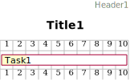
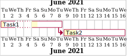
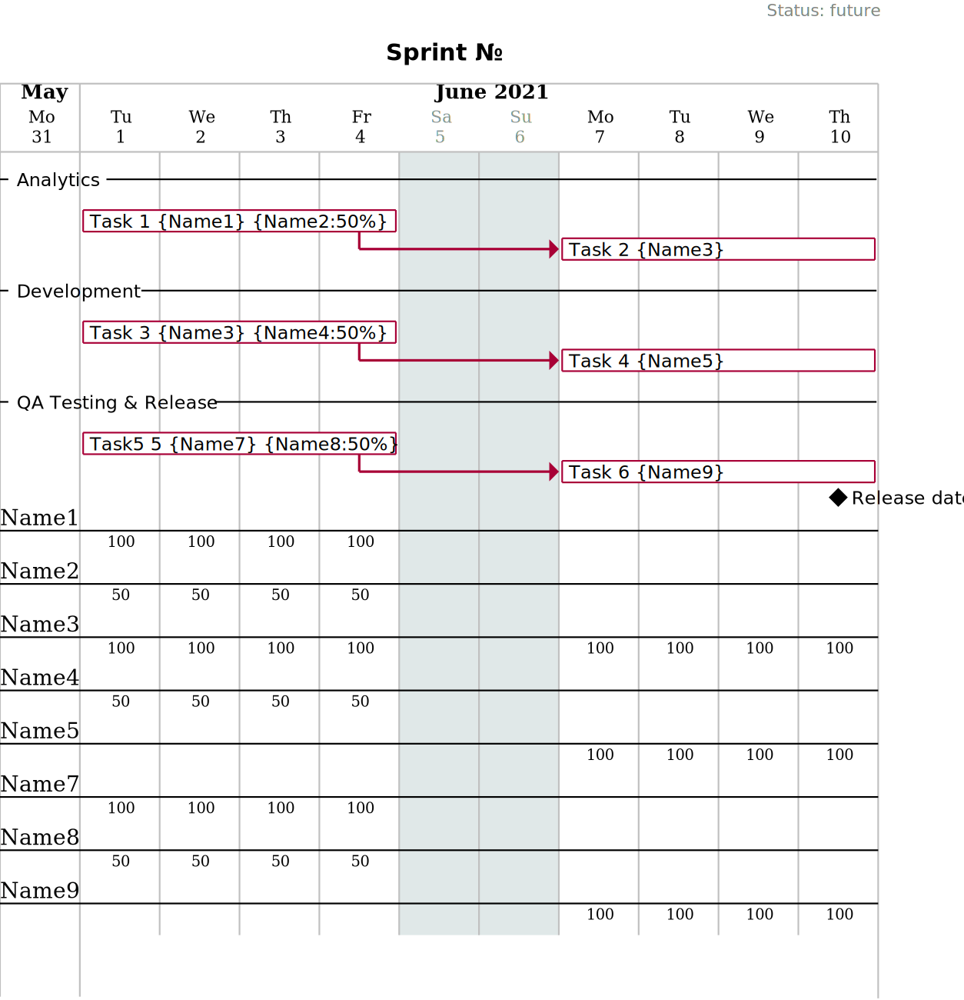

= Clojure wrapper for PlantUML Gantt 
:git:               https://git-scm.com[git]
:clojure-deps-cli:  https://clojure.org/guides/getting_started[clojure deps cli]
:clj-new:           https://github.com/seancorfield/clj-new[clj-new]
:just:              https://github.com/casey/just[just]
:babashka:          https://github.com/babashka/babashka[babashka]
:toc:               macro
:toclevels:         4

*It is alpha version but it works! Everything is subject to change.*

== Quick Intro

This program (named `gantt`) is based on link:https://github.com/plantuml/plantuml[PlantUML] v1.2022.5. +

Program `gantt` uses some subset of PlantUML Gantt syntax to describe a project, its structure, and progress. +

Program `gantt` transforms: `EDN data` -> `SVG/PNG` picture without any external dependencies. 
Also, it produces intermediate `puml`-file for every picture. +

To produce the picture above the following command was used:

[source,bash]
----
java -Duser.language=en -Djava.awt.headless=true -jar gantt.jar -f svg -i ./doc -o :input-folder generate
----

Click here to see link:doc/programming-clojure-plan.edn[EDN source] for the picture above using link:https://github.com/edn-format/edn[EDN format]. +
Click here to see intermediate link:doc/programming-clojure-plan.edn.puml[PUML file]  produced from EDN.  +

== Download

Download the latest version of the `gantt` program: link:https://github.com/redstarssystems/gantt/releases/[] 

== Motivation

Planning in software development is an important part of communications with managers and teams. +

Visualization of the project progress makes communications with managers and the team more productive. +

Manual drawing of the project progress is very time expensive. +

External Gantt tools are not always convenient for the whole team, not accessible for managers or not accessible from a 
secured environment, and demand context switching and learning. +

Any language which has a syntax based on unstructured data promotes a huge number of errors which is not easy to find.

.As an engineer I want:
- to have a detailed plan for every big feature developed by several teams in parallel;
- to have a structured data language to describe project structure, task dependencies, resource allocation, and progress;
- to quickly visualize the whole project and its progress;
- to work only in my IDE and update data of the project;
- that any team member can read and update data of the project using their favorite IDE;
- that any program can read and update data of the project (make project data machine-readable);
- to reproduce project progress in the past based on data using `git`;
- that CI/CD tools can convert data to SVG/PNG picture with current project progress and publish it to any location;
- automatically update `asciidoc` documents with a picture of actual project progress.

toc::[]

== Usage

[source,bash]
----
$ java -jar gantt.jar --help
Gantt diagram generator.

Usage: program-name [options] action

Options:
  -p, --port PORT             8080       HTTP server port number
  -s, --server HOST           localhost  start HTTP server using this hostname
  -i, --input-folder FOLDER              Input folder with EDN-files
  -f, --file-format FORMAT    png        PNG or SVG format for output files
  -o, --output-folder FOLDER             Output folder to write Gantt diagrams. Use value `:input-folder` to put result in the input folder.
      --delete-puml                      Delete intermediate `puml` file
  -h, --help

Actions:
  server   Start HTTP server to show generated Gantt diagrams via HTTP
  watch    Run watchdog for input folder changes to produce Gantt diagrams to output folder
  generate Generate Gantt diagrams from input folder to output folder and exit

Please refer to the manual page https://github.com/redstarssystems/gantt for more information.
----

=== Generate mode

This mode is activated by `generate` action and may be used in scripts. +

The program will scan the input folder and all its subfolders for EDN files.
`gantt` will generate `PNG/SVG` pictures and save them to the output folder and exit. +

The parameter `--output-folder` may have a special value `:input-folder` which means that `PNG/SVG` pictures should be 
saved in the same folder where EDN-file was found. +

Example:

[source,bash]
----
$ java -Duser.language=en -Djava.awt.headless=true -jar gantt.jar -f svg -i ./doc -o :input-folder generate
----

`-Djava.awt.headless=true` is used to prevent loss of focus in other programs. +
`-Duser.language=en` is used to control Locale for days and months in output PNG/SVG pictures. +

=== Watchdog mode

This mode is activated by the `watch` action and starts a long-running process. +

This mode is useful if you want to update `PNG/SVG` pictures automatically when any EDN-file is added or changed. +

The program will catch any `create` or `update` file-system event for EDN-files in the input folder and all its subfolders. +

[source,bash]
----
$ java -Duser.language=en -Djava.awt.headless=true -jar gantt.jar -f png -i /Users/mike/projects/gantt/doc -o :input-folder watch
Starting watchdog for folder: /Users/mike/projects/gantt/doc
Press <Enter> to exit.

----

`-Djava.awt.headless=true` is used to prevent loss of focus in other programs. +
`-Duser.language=en` is used to control Locale for days and months in output PNG/SVG pictures. +

=== Server mode

This mode is activated by `server` action and starts two long-running processes. First process – `watchdog` mode is running to
automatically update pictures. Second process – `web server` which is expose _PNG/SVG_ files as static resources from 
`output-folder`. All other filetypes are filtered and never exposed via web.

[source,bash]
----
java -Duser.language=en -Djava.awt.headless=true -jar target/gantt-0.1.4-standalone.jar -f svg -i /Users/mike/projects/planning -o :input-folder --delete-puml server  -s 0.0.0.0

Starting watchdog for folder: /Users/mike/projects/planning
Running web server on address 0.0.0.0 and port 8080
Serving /Users/mike/projects/planning folder. Use it as root path to access image files.
Press <Enter> to stop watching.
Press <Ctrl-C> to exit
----

== Syntax

To describe project structure and its progress use EDN-file with one global map. +

Inside this map, you may use all flags described in this section. +

=== Example 1

Example of the project with one task:

[source, clojure]
----
{:project-title   "Title1"
 :project-header  "Header1"

 :project-scale   :daily
  
 :project-content [{:task             "Task1"
                    :alias            :t1
                    :days-lasts       10
                    :percent-complete 20}]
}
----

This will produce the following picture: +

=== Project Title

To set project title use:

[source, clojure]
----
{:project-title   "Title1"}
----

=== Project Header

To set project header use:

[source, clojure]
----
{:project-header  "Header1"}
----

=== Project Footer

To set project footer use:

[source, clojure]
----
{:project-footer  "Footer1"}
----

=== Project scale

To set appropriate project scale:

[source, clojure]
----
{:project-scale  :daily} 
----

Possible values are: `:daily :monthly :weekly :quarterly :yearly`

Example: +

Also, the project scale may be set with zoom:

[source, clojure]
----
{:project-scale-zoom  {:scale :daily 
                       :zoom   2}} 
----

This will produce the following effect: +

=== Image size

To control output PNG/SVG image size use:

[source, clojure]
----
{:scale           "1200*900"}
----

=== Disable/Enable footbox

This flag can enable/disable duplication of days in a footbox.

[source, clojure]
----
{:hide-footbox?   true}
----

=== Example 2

[source, clojure]
----
{:scale           "320*180"
 :project-scale   :daily
 :project-title   "Title1"
 :project-header  "Header1"
 :project-footer  "Footer1"
 :hide-footbox?   true

 :project-content [{:task             "Task1"
                    :alias            :t1
                    :days-lasts       10
                    :percent-complete 20}]}

----

This will produce the following picture: +

=== Project start date

Without project start date the `gantt` will numerate days in increasing order. +

When the project start date is set the `gantt` will display a calendar depending on `:project-scale` value. +

To set project start date use:

[source, clojure]
----
{:project-starts     "2021-05-27"}
----

Example: +

=== Locale & Calendar

The current version of PlantUML has hardcoded English values for the days of week and months. +

The `gantt` has some hacks to avoid this behavior and displays days and months according to the JVM locale. +

If you want to change locale to Russian then just run JVM for this program with flag `-Duser.language=ru`. +

By default, `gantt` will take locale from the operating system.

=== Colors

The colors in various places in `gantt` may be set in several notations as `String` values: +

. Simple names. Examples: "green", "fuchsia"  
. Complex names. Example: "GreenYellow/Red" 
. Hex values. Example: "#FF0000/FFFF00"

See link:https://plantuml.com/ru/color[PlantUML colors] and here link:https://github.com/qywx/PlantUML-colors[PlantUML color names]

=== Tasks colors

To set colors for all tasks in the project use the flag:

[source, clojure]
----
{ :tasks-colors    {:color/in-progress "GreenYellow/Red"
                    :color/completed   "GreenYellow/Green"}}
----

It is possible to set particular color for the individual task using `:color` flag inside a task:

[source, clojure]
----
{
:project-content [{:task             "task3"
                    :alias            :t3
                    :days-lasts       10
                    :percent-complete 0
                    :starts-after     :t2
                    :color            "Gold/Black"}]
}
----

=== Days colors

To set colors for a particular day in the project use this flag:

[source, clojure]
----
{ :days-colors     [{:color     "GreenYellow/Green"
                   :days-list ["2021-06-02" "2021-06-08"]}] }
----

To set colors for days range in the project use this flag:

[source, clojure]
----
{ :days-colors     [{:color      "salmon"
                    :days-range {:days-name "out of office" ;; optional field
                                 :from      "2021-06-04"
                                 :to        "2021-06-06"}}]}
----

Examples: +

=== Holidays

To set holidays inside the project use flag `:holidays`:

[source, clojure]
----
{ :holidays        ["2021-05-03" "2021-05-10"]}
----

=== Closed days

To set days of week closed for work use flag `:closed-days`:
[source, clojure]
----
{ :closed-days     #{:saturday :sunday}}
----

Possible values are: `:sunday :monday :tuesday :wednesday :thursday :friday :saturday`

=== Highlight today

To highlight today use flag `:today`: +
[source, clojure]
----
{ :today       {:days-after-start 10 :color "#AAF"}}
----

=== Milestones

Milestone is an important point for the project.

Milestones can be set in section `:milestones`:

[source, clojure]
----
{
:milestones      [{:milestone     "m1"
                    :happens-after [:t1]}  ;; relative milestone (after task :t1)

                   {:milestone  "m3"
                    :happens-at "2021-05-20"}] ;; absolute milestone
}      
----

Also, milestones can be set between tasks: 

[source, clojure]
----
{:project-content [{:task             "task2"
                    :alias            :t2
                    :days-lasts       10
                    :percent-complete 34
                    :starts-after     :t1}

                   {:task             "task3"
                    :alias            :t3
                    :starts-at        "2021-05-06"
                    :ends-at          "2021-05-18"
                    :percent-complete 0} 

                   {:milestone     "Milestone 1"
                    :happens-after [:t2 :t3]}        ;; relative milestone
                   
                   {:milestone  "Milestone 2"
                    :happens-at "2021-05-20"}]}      ;; absolute milestone
----

=== Separator

A separator is a horizontal line with some description:

[source, clojure]
----
{:project-content [{:separator "Stage1"}]}
----

=== Inline text at the beginning

Inline text to set custom Plantuml values. 
Text will be added at the beginning of the puml-file:

[source, clojure]
----
{:inline-text-begin  ""}
----

=== Inline text to the end

Inline text to set custom Plantuml values. 
Text will be added to the end of the puml-file:

[source, clojure]
----
{:inline-text-end  "[learn-clojure-site] links to [[http://www.clojure.org]]"}
----

=== Tasks

The tasks should be described in section `:project-content`

[source, clojure]
----
{:project-content [
                   ;; put tasks, milestones, separators here
                  ]}
----

Task spec: +

[source, clojure]
----
[:map
         [:task task-name]
         [:alias task-alias]
         [:links-to {:optional true} task-links-to]
         [:percent-complete task-percent-complete]
         [:color {:optional true} color]
         [:resources {:optional true} [:vector {:gen/min 1, :gen/max 3} task-resource]]
         [:pause-on-days {:optional true} [:vector {:gen/min 1, :gen/max 3} string-date]]
         [:starts-at {:optional true} task-starts-at]
         [:starts-before-end {:optional true} task-starts-before-end]
         [:starts-after-end {:optional true} task-starts-after-end]
         [:ends-at-start {:optional true} task-ends-at-start]
         [:ends-at-end {:optional true} task-ends-at-end]
         [:days-lasts {:optional true} task-days-lasts]
         [:ends-at {:optional true} task-ends-at]
         [:starts-after {:optional true} task-starts-after]]
----

==== Task Resources

Resources can be defined inside every task using `:resources` vector of Strings. +
Every string in a vector is a named resource. +
By default, every resource is occupied 100% for the task. +
If you need to specify a particular percent for the resource for this task then after resource name put `:` and amount of percent. +  

[source, clojure]
----
{
 :project-starts  "2021-06-01"
 :project-scale   :daily

 :project-content [{:task             "Task1"
                    :alias            :t1
                    :starts-at        "2021-06-01"
                    :days-lasts       6
                    :resources        ["Mike" "Olga:50%"]
                    :percent-complete 20}

                   {:task             "Task2"
                    :alias            :t2
                    :starts-after     :t1
                    :days-lasts       8
                    :resources        ["Olga:50%"]
                    :percent-complete 20}]

 }
----

This will produce the following picture: +

==== Task URL

A task may have a clickable URL (e.g. Jira task) when generating SVG file. 
To set clickable URL use `:links-to` property and string URL as a value.

[source, clojure]
----
{
 :project-content [{:task             "Learn Clojure.org"
                    :alias            :learn-clojure-site 
                    :starts-at        "2021-06-01"
                    :ends-at          "2021-06-04"
                    :links-to         "http://www.clojure.org"
                    :percent-complete 100}]
}
----

==== Fixed start

A task may have a fixed start on a particular day.
To set fixed start date use `:starts-at` property and string date as a value.

[source, clojure]
----
{
 :project-content [{:task             "Task1"
                    :alias            :t1
                    :starts-at        "2021-06-01"  ;; fixed start date
                    :days-lasts       6
                    :percent-complete 20}]
}
----

==== Relative start

A task may have a relative start.
To set relative start use `:starts-after` property with task alias as a value. + 
This means that this task will start after other task ends.

[source, clojure]
----
{
 :project-content [{:task             "Task2"
                    :alias            :t2
                    :starts-after     :t1 ;; Task2 starts after task :t1 ends
                    :days-lasts       8
                    :percent-complete 20}]
}
----

A task may have another relative start: start before N days another task ends.
To set this relative start use `:starts-before-end` property with vector with two values. + 
First value is task alias, second value is a number of days before this task alias end. + 

[source, clojure]
----
{
 :project-content [{:task              "task5"
                    :alias             :t5
                    :days-lasts        10
                    :percent-complete  0
                    :starts-before-end [:t2 3]}]  ;; task :t5 starts before 3 days :t2 ends
}
----

A task may have another relative start: start after N days after another task ends.
To set this relative start use `:starts-after-end` property with a vector with two values. + 
The first value is task alias, the second value is the number of days after this task alias end. + 

[source, clojure]
----
{
 :project-content [{:task             "task6"
                    :alias            :t6
                    :days-lasts       15
                    :percent-complete 0
                    :starts-after-end [:t1 3]}]  ;; task :t6 starts after 3 days after :t1 ends
}
----

==== Fixed end

A task may have a fixed end date on a particular day.
To set fixed end date use `:ends-at` property and string date as a value.

[source, clojure]
----
{
 :project-content [{:task             "Task1"
                    :alias            :t1
                    :starts-at        "2021-06-01"  ;; fixed start date
                    :ends-at          "2021-06-05"  ;; fixed end date
                    :percent-complete 20}]
}
----

==== Relative end

A task may have relative end: this task ends at the same time as another task ends.
To set this relative end use `:ends-at-end` property with task alias as a value. +

[source, clojure]
----
{
 :project-content [{:task              "task5"
                    :alias             :t5
                    :days-lasts        10
                    :percent-complete  0
                    :ends-at-end :t2}]  ;; :t5 ends when :t2 ends
}
----

A task may have relative end: this task ends when another task starts.
To set this relative end use `:ends-at-start` property with task alias as a value. +

[source, clojure]
----
{
 :project-content [{:task              "task5"
                    :alias             :t5
                    :days-lasts        10
                    :percent-complete  0
                    :ends-at-start :t8}]  ;; :t5 ends when :t8 starts
}
----

==== Task pause

A task may be paused on particular days using `:pause-on-days` 

[source, clojure]
----
{
 :project-starts  "2021-06-01"
 :project-scale   :daily

 :project-content [{:task             "Task1"
                    :alias            :t1
                    :pause-on-days    ["2021-06-03" "2021-06-04"]
                    :starts-at        "2021-06-01"
                    :days-lasts       6
                    :percent-complete 20}

                   {:task             "Task2"
                    :alias            :t2
                    :starts-after     :t1
                    :days-lasts       8
                    :percent-complete 20}]

 }
----
This will produce the following picture: +

=== Examples 

==== Sprint Plan template

If you have `git` you can put EDN-file with the Sprint plan and share it with your team. +
Any team member can update task progress. +
CI/CD tools, using `gantt`, can generate `PNG/SVG` picture with a Sprint progress, and publish it on dashboard. + 

[source, clojure]
----
{
 :scale              "1900*1300"                            ;; picture size

 :project-title      "Sprint № "                            ;; sprint number
 :project-header     "Status: future"                       ;; status: future or completed
 :project-starts     "2021-05-31"                           ;; sprint start date
 :project-scale-zoom {:scale :daily :zoom 3}

 :tasks-colors       {:color/in-progress "GreenYellow/Red"
                      :color/completed   "GreenYellow/Green"}

 :closed-days        #{:saturday :sunday}                   ;; weekends
 :holidays           ["2021-06-14"]                         ;; holidays

 :hide-footbox?      true                                   ;; hide calendar at the bottom

 :project-content    [
                      ;;;;;;;;;;;;;;;;;;;;;;;;;;;;;;;;;;;;;;;;;;;;;;;;;;;;;;;;;;;;;;;;;;;;
                      {:separator "Analytics"}

                      {:task             "Task 1"
                       :alias            :t1
                       :resources        ["Name1" "Name2:50%"]
                       :starts-at        "2021-06-01"
                       :ends-at          "2021-06-04"
                       ;; :color            "Red/Red"       ;; uncomment at the end of a sprint if task is not completed
                       :percent-complete 0}

                      {:task             "Task 2"
                       :alias            :t2
                       :resources        ["Name3"]
                       :starts-after     :t1
                       :days-lasts       4
                       ;; :color            "Red/Red"       ;; uncomment at the end of a sprint if task is not completed
                       :percent-complete 0}
                      ;;;;;;;;;;;;;;;;;;;;;;;;;;;;;;;;;;;;;;;;;;;;;;;;;;;;;;;;;;;;;;;;;;;;
                      {:separator "Development"}

                      {:task             "Task 3"
                       :alias            :t3
                       :resources        ["Name3" "Name4:50%"]
                       :starts-at        "2021-06-01"
                       :ends-at          "2021-06-04"
                       ;; :color            "Red/Red"        ;; uncomment at the end of a sprint if task is not completed
                       :percent-complete 0}

                      {:task             "Task 4"
                       :alias            :t4
                       :resources        ["Name5"]
                       :starts-after     :t3
                       :days-lasts       4
                       ;; :color            "Red/Red"      ;; uncomment at the end of a sprint if task is not completed
                       :percent-complete 0}

                      ;;;;;;;;;;;;;;;;;;;;;;;;;;;;;;;;;;;;;;;;;;;;;;;;;;;;;;;;;;;;;;;;;;;;
                      {:separator "QA Testing & Release"}

                      {:task             "Task5 5"
                       :alias            :t5
                       :resources        ["Name7" "Name8:50%"]
                       :starts-at        "2021-06-01"
                       :ends-at          "2021-06-04"
                       ;; :color            "Red/Red"       ;; uncomment at the end of a sprint if task is not completed
                       :percent-complete 0}

                      {:task             "Task 6"
                       :alias            :t6
                       :resources        ["Name9"]
                       :starts-after     :t5
                       :days-lasts       4
                       ;; :color            "Red/Red"       ;; uncomment at the end of a sprint if task is not completed
                       :percent-complete 0}

                      {:milestone     "Release date"
                       :happens-after [:t5 :t6]}
                      ]
 }

----

This will produce the following picture: +

==== Planning with reverse order

The main idea is to put the first task as a whole project with a fixed end date or duration. +
Then create project subtasks after the first task using `:ends-at-start` and `:ends-at-end` flags to control their end. +

[source, clojure]
----
{
 :project-scale   :daily

 :project-content [{:task             "whole project"
                    :alias            :t5
                    :days-lasts       30
                    :percent-complete 0
                    :color            "Gray"}

                   {:task             "task4"
                    :alias            :t4
                    :days-lasts       4
                    :percent-complete 0
                    :ends-at-end      :t5}

                   {:task             "task3"
                    :alias            :t3
                    :days-lasts       4
                    :percent-complete 0
                    :ends-at-start    :t4}

                   {:milestone     "m2"
                    :happens-after [:t3]}

                   {:task             "task2"
                    :alias            :t2
                    :days-lasts       12
                    :percent-complete 0
                    :ends-at-start    :t3}

                   {:task             "task1"
                    :alias            :t1
                    :days-lasts       10
                    :percent-complete 0
                    :ends-at-start    :t2}

                   {:milestone     "m1"
                    :happens-after [:t1]}]
 }
----

This will produce the following picture: +

== Build this project

Project `gantt` generated from https://github.com/redstarssystems/rssysapp[Application template].

=== Install project prerequisites

All these tools you need to install only once.

. Install {clojure-deps-cli} tools
.. MacOS
+
[source,bash]
----
brew install clojure/tools/clojure
----

.. Linux
+
Ensure that the following dependencies are installed in OS: `bash`, `curl`, `rlwrap`, and `Java`.
+
[source,bash]
----
curl -O https://download.clojure.org/install/linux-install-1.10.3.822.sh
chmod +x linux-install-1.10.3.822.sh
sudo ./linux-install-1.10.3.822.sh
----

. Install latest {clj-new} library to a file `~/.clojure/deps.edn`
+
[source,clojure]
----
{
 :aliases {
           :new     {:extra-deps {seancorfield/clj-new {:mvn/version "1.1.297"}}
                     :exec-fn    clj-new/create}
          }
 }
----

. Install {babashka}
.. MacOS
+
[source,bash]
----
brew install borkdude/brew/babashka
----
+
.. Linux
+
[source,bash]
----
sudo bash < <(curl -s https://raw.githubusercontent.com/babashka/babashka/master/install)
----

. Run once:
+
[source,bash]
----
just requirements
----

to install other necessary tools (MacOS only, for Linux manual instruction).

=== Project workflow

To build distributive run: `bb build`

To configure project workflow scripts use `bb.edn`.

To configure the project version use file `project-version`.

To configure `group-id` and `artifact-id` for jar file use file `project-config`.

To configure secrets & passwords use file `project-secrets.edn`.

Run `bb tasks` to show help for project workflow.

List of available tasks:

[sources]
----
clean        Clean target folder
build        Build application for this project (standalone uberjar file)
install      Install application uberjar file locally (requires the pom.xml file)
deploy       Deploy this application
run          Run application
repl         Run Clojure repl
outdated     Check for outdated dependencies
bump         Bump version artifact in `project-version` file, level may be one of: major, minor, patch, alpha, beta, rc, release.
test         Run tests
format       Format source code
lint         Lint source code
javac        Compile java sources (if any)
jar          Build thin jar file for this application
standalone   Create a standalone application with bundled JDK (using jlink, JDK 9+)
requirements Install project requirements
----

=== License

This work is dual-licensed under Eclipse Public License 2.0 and GPL 3.0. +
PlantUML and java sources in  `java/src` are under GPL 3.0. (C) Copyright 2009-2020, Arnaud Roques + 

The rest of the program is under EPL 2.0. Copyright © 2021 Mikhail Ananev +
You can choose between one of them if you use this work. +

`SPDX-License-Identifier: EPL-2.0 OR GPL-3.0-or-later`

